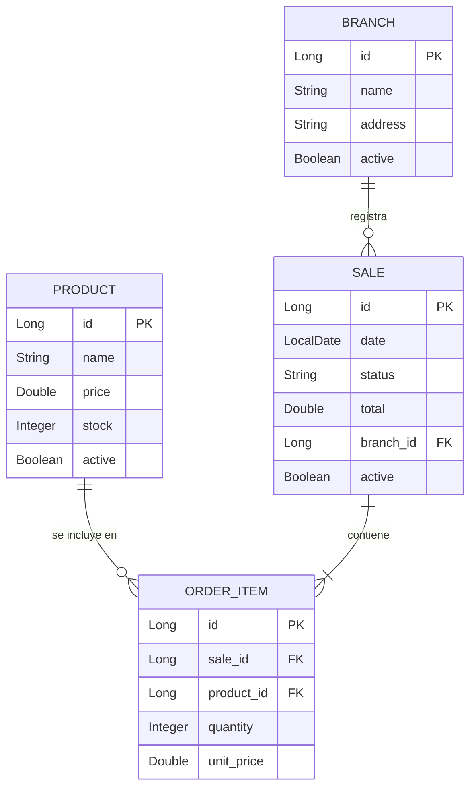

# 🛒 Supermarket API

API REST para la gestión de sucursales, productos y ventas de una cadena de supermercados, construida con **Spring Boot 3**, **JPA/Hibernate** y **Java 21**.

## 📊 Modelo de Datos (DER)

A continuación se detalla la estructura de la base de datos. El sistema utiliza **Borrado Lógico** en las entidades principales para mantener la integridad histórica.

    
    

🚀 Características Principales
Borrado Lógico (Soft Delete): Implementado mediante las anotaciones @SQLDelete y @SQLRestriction para Branch, Product y Sale.

Gestión de Stock: Al crear una venta, el sistema valida y descuenta automáticamente el stock de los productos.

Auditoría de Ventas: Al anular una venta (borrado lógico), el sistema devuelve automáticamente el stock al inventario y marca la transacción como "ANULADA".

Precios Históricos: Se almacena el unit_price en el momento de la venta para evitar que cambios de precio futuros alteren los registros históricos.

🛠️ Tecnologías Utilizadas
Java 21 (Uso de Records, Streams y nuevas APIs).

Spring Boot 3.x

Spring Data JPA

Lombok

MySQL / PostgreSQL

📂 Estructura del Proyecto
model/: Entidades JPA.

dto/: Data Transfer Objects (Records) para comunicación segura.

repository/: Interfaces de acceso a datos con consultas nativas para auditoría.

service/: Lógica de negocio y manejo de transacciones (@Transactional).

mapper/: Conversión entre Entidades y DTOs.

## 🏗️ Arquitectura de Capas

El proyecto sigue el patrón de diseño de capas para separar las responsabilidades de la base de datos, la lógica de negocio y la presentación de datos.

| Capa | Responsabilidad | Ejemplo de Implementación |
| :--- | :--- | :--- |
| **Repository** | **Acceso a Datos:** Consultas directas a MySQL (SQL/JPQL). Trabaja únicamente con Entidades. | `List<Product> findByNameContaining(String name);` |
| **IProductService** | **Contrato de Servicio:** Define qué operaciones están disponibles para el controlador. | `List<ProductDTO> searchByName(String name);` |
| **ProductService** | **Lógica de Negocio:** Procesa datos, aplica reglas y transforma Entidades en DTOs. | `repo.findByName(...)` → `Mapper.toDTO` → `return` |

### 🔄 Flujo de Datos
1. El **Controller** recibe una petición y llama al **IProductService**.
2. El **ProductService** solicita los datos al **Repository**.
3. El **Repository** consulta la base de datos **MySQL** y devuelve una **Entidad**.
4. El **ProductService** recibe la Entidad, la convierte en **DTO** mediante un Mapper y la devuelve al Controller.

### 🛡️ Autorización (Roles)

La API define dos roles principales con diferentes permisos:

| Rol | Descripción | Permisos |
| :--- | :--- | :--- |
| **USER** | Usuario estándar | Lectura (`GET`) |
| **ADMIN** | Administrador | Lectura (`GET`), Escritura (`POST`, `PUT`, `DELETE`) |

### 🛤️ Mapeo de Endpoints y Roles

| HTTP Método | Endpoint | Rol Requerido |
| :--- | :--- | :--- |
| `POST` | `/api/auth/**` | Ninguno (Público) |
| `GET` | `/api/**` | `ROLE_USER`, `ROLE_ADMIN` |
| `POST` | `/api/**` | `ROLE_ADMIN` |
| `PUT` | `/api/**` | `ROLE_ADMIN` |
| `DELETE` | `/api/**` | `ROLE_ADMIN` |

---

### ⚙️ Configuración (.env)

Para ejecutar la aplicación, asegúrate de configurar las siguientes variables de entorno:

* `JWT_SECRET`: Clave secreta para firmar los tokens (mínimo 32 caracteres).
* `JWT_EXPIRATION`: Tiempo de validez del token en milisegundos.